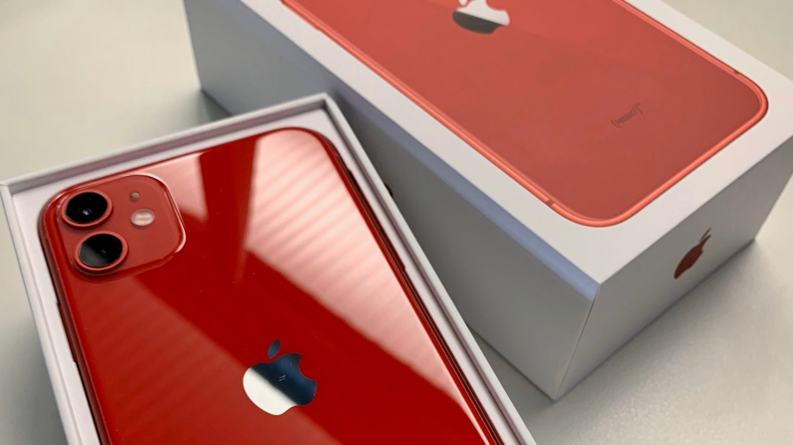
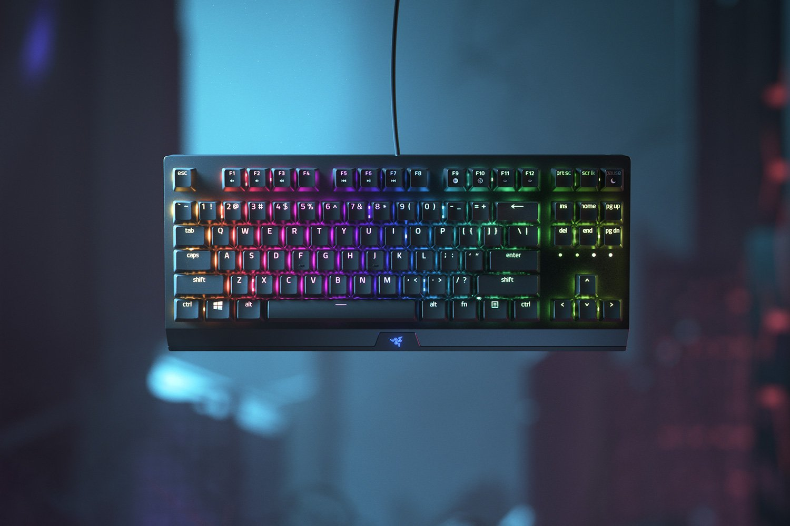
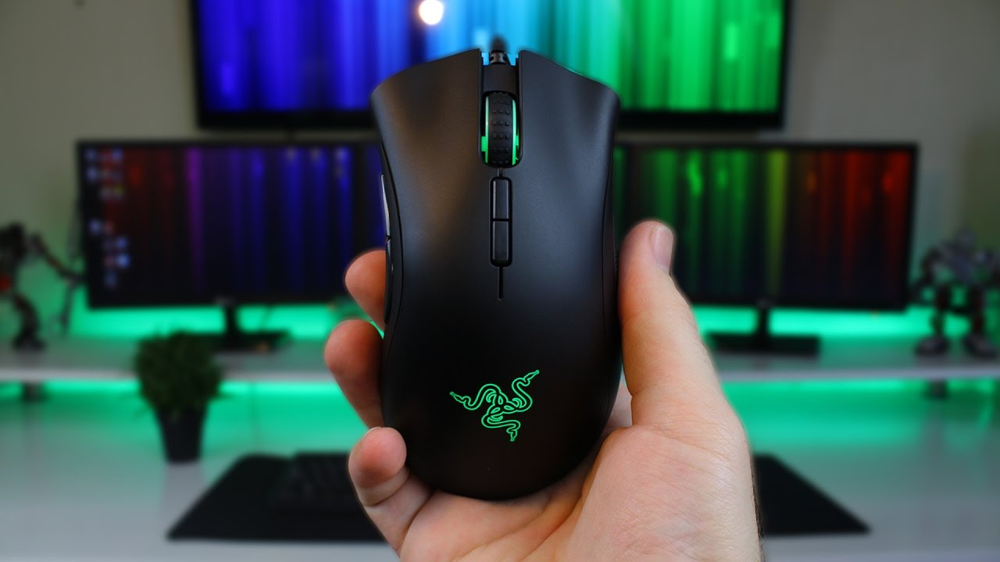
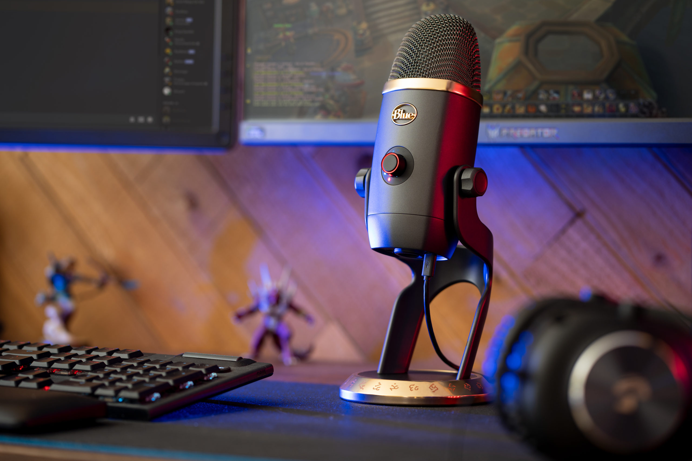
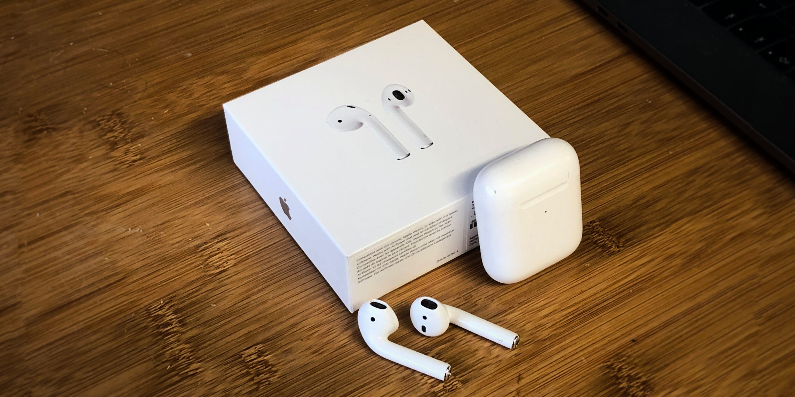
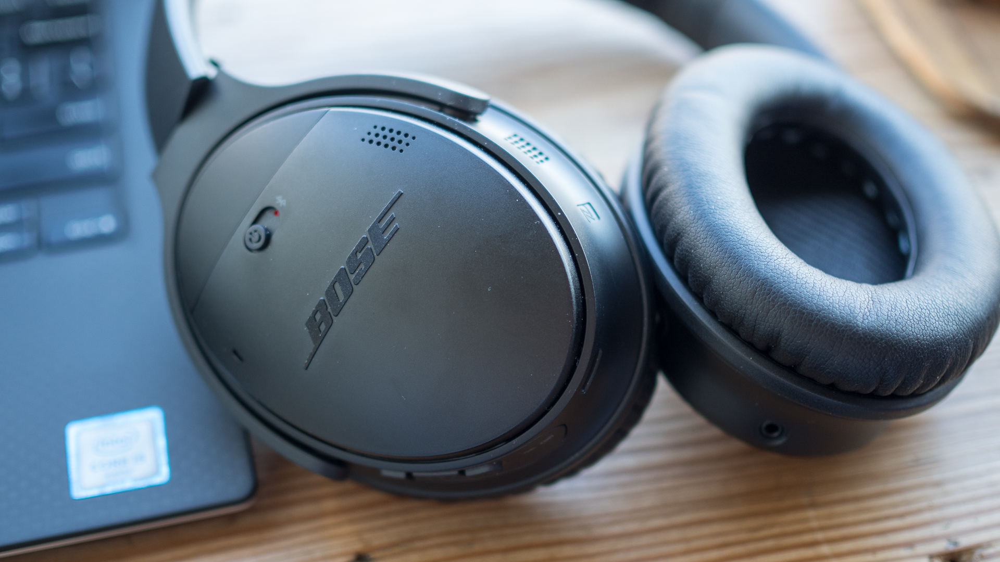
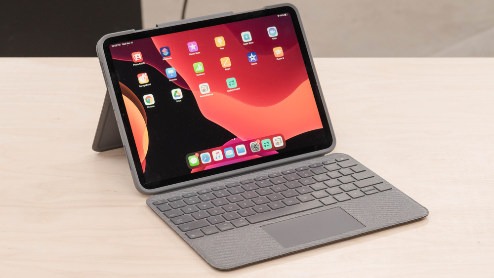

I have always been fascinated by technology. I am often looking for the latest pieces of tech which I can afford. This list is the an always updated list of gadgets I use daily. Use the table of contents above to browse as you wish.

**Note:** *Some of these things were actually taken care by my Employer (Thank You Microsoft). I don't recommend spending a lot of money on gadgets unless you are financially independent, can afford them and they provide value.*

## Phone

My daily driver is iPhone 11 in Red. This is my first iPhone because during college I was into Android development hence it made sense to use an Android device. But now, I'm entrenched into the apple ecosystem and I don't think I'm switching to android anytime soon.

## Laptop 

My current Personal Laptop is the MSI GV627RE. It's a gaming laptop which I bought in 2018 after my placement and it's still performing like a beast. 

### Specs
- **Chipset** : Intel Core i7 - 7700HQ
- **Graphics** : Nvidia GeForce GTX 1050Ti
- **RAM** : 16BG
- **Storage** : 1TB HDD + 128GB SSD (PCI - E Gen.3)

## Keyboard 

Keyboard is an essential everyday tool now. We type more than we right. I am always on the hunt for finding the perfect keyboard which suits my needs. My keyboard of choice is the Razer Blackwidow Chroma Tournament Edition. I feel this is the best keyboard for programmers, gamers and anyone who is looking for an awesome typing experience. This is keyboard is awesome because : 
- It's mechanical (hence the satisfying click!)
- It's ten key less (no numpad because I don't need it) 
- It's RGB (change lights according to your mood)
- It has a standard layout with no fancy-ass buttons etc. which helps me type fast(I touch type)

## Mouse

My current mouse of choice is Razer Deather Elite Chroma. To be honest, you can go cheap on a mouse if you do only programming because a good sensor won't help you much. But since I play CS:GO(the game which never dies), I wanted a mouse with a good sensor. 

## Microphone

Okay, this is the most overkill thing and I won't recommend most of you to buy this. I use the Blue Yeti Microphone. I had no intentions to buy it but one fine day I found an awesome deal on amazon where this Mic was available for 5000 rupees refurbished. I use it for : 
- Recording guitar covers.
- Video Calls.
- In Games.

## Headphones

I have two headsets and I use them for various purposes : 

- **Apple Airpods** : I use these while listening to podcasts, during workouts, calls etc. They connect seemlessly to my apple devices.
- **Bose QC35 II** : I use these while working out primarily because they have active noise cancellation and helps me concentrate.

## Tablet

I have been a tablet user for more than 4 years now. I love to draw, design and do other creative stuff and my iPad Pro 2020 helps me unleash my creativity. I use apple pencil and Logitech folio touch keyboard case for my iPad. iPad is perhaps my favourite piece of tech.

~ Jatin Narula

