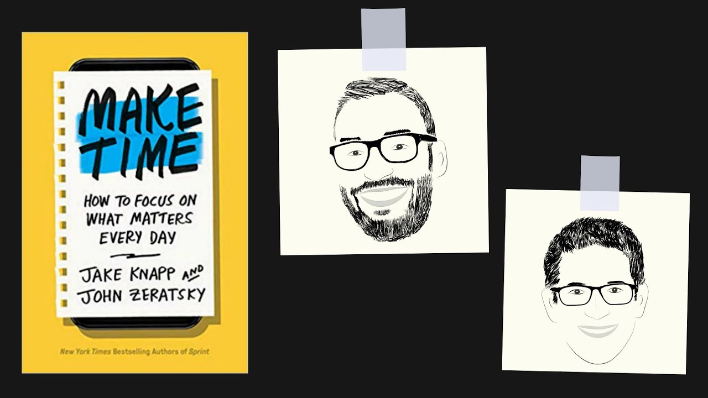
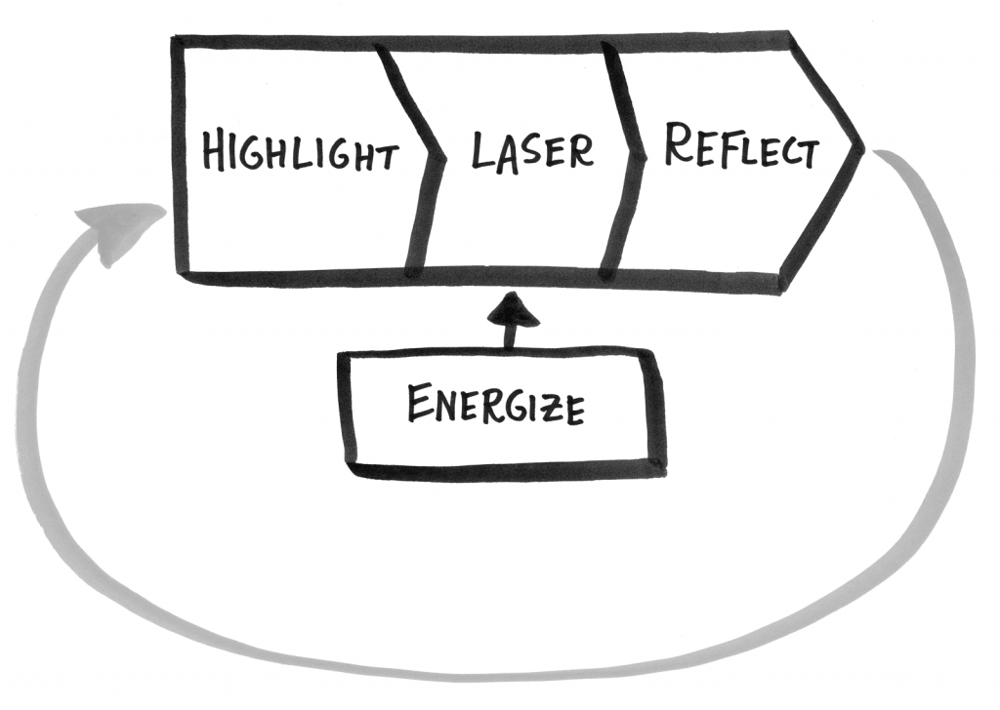
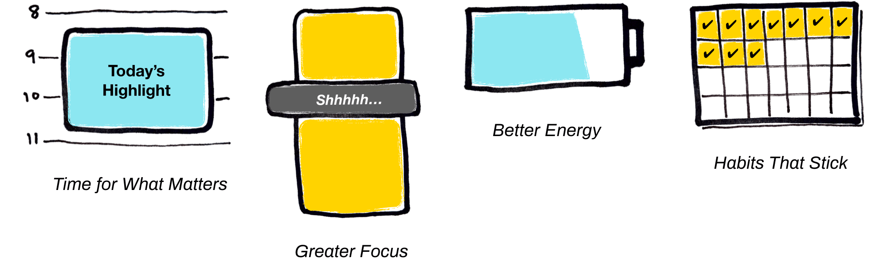
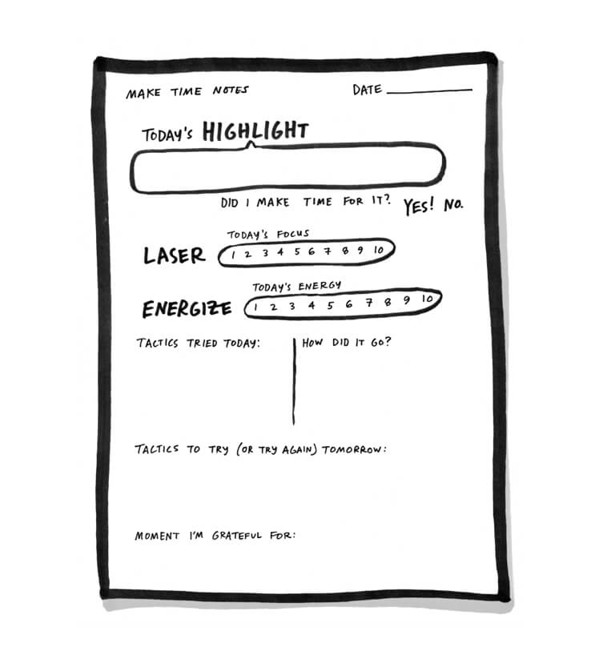

One of my resolutions for this year is to read 12 books. I have been procastinating a lot, so I decided I'll be more accountable and I'll share my learnings from these books every month in the form of blogs.
I have recently read the book called 'Make Time' which is sort of a productivity book. Actually, for the most part I always thought that reading productivity books is a waste of time because one never applies the teachings and it just gives you a boost of motivation for sometime, which obviously fades away. But this book was different. It did help me in managing my time better.  :smiley:

## From the Authors 

**A Friendly Approach to Focus and Energy**

Make Time is not about crushing your to-do list, optimizing every hour, or maximizing personal productivity. It’s about rethinking the defaults of constant busyness and distraction so you can focus on what matters every day.

## Why is Life So Busy ? 

There are mainly two reasons for this, as highlighted in the book : 
- The idea of busy bandwagons
- Infinity Pools

The idea of **busy bandwagons** states that we consider being busy as a badge of honour. Atleast for me even if I am taking a little break, I feel guilty that I am not doing something productive with my time. We have this constant feeling that if we slowdown, we are going to fall behind.

**Infinity pools** are anything - apps, services etc. that have an infinite supply of content which is always refreshing. There is always plenty of water in the pool and you can jump in at anytime.

**Busy Bandwagons** defaults to endless tasks.
**Infinity pools** default to endless distractions.

We have identified the problems, but what is the solution now ? :bulb:

## Building a Framework that works for YOU

Let's be honest. There is **no single solution** which works for everyone to help him/her stay productive. What everyone needs is a customized framework which works according to his/her goals and lifestyle. This book basically explains how you can build your own productivity system based on a four-part framework : 
- **Highlight**
- **Laser**
- **Energize**
- **Reflect**

## Figuring Out Your Daily Highlight

The idea is if you set a single intention of what you need to achieve at the starting of each day, you'll be more satisfied and effective. This doesn't mean you do a single thing during the day. Your highlight should be something which you definitely want to get done at the end of the day. I have personally tried this and this actually helps. Trust me **writing down your daily highlight along with your todo helps you separate out the most important task during the day**. Otherwise you might find yourself struggling with the less important tasks and ignoring what needs to be done.
The highlight can be anything - finishing a piece of work, working out, reading a book etc. It's something we definitely want to make time for during that day. Again you can rotate this accordingly. For me, sometimes my daily highlight involves coding some feature, sometimes it's reading a book or playing the guitar etc.

**"Focusing on a daily highlight stops the tug-of-war between infinity pool distractions and the demands of the busy bandwagon."**

**Be intentional and focus on how you spend your time**

Now to decide on what can be your daily highlight, you can choose it based on urgency, satisfaction and joy. Let's say I have a deadline coming up, then my highlight will be to complete the feature. Let's say its a less busy day, then my highlight will be playing the guitar or anything that makes me happy.

Whenever I make the todo for the day, I write down my daily highlight as well.

## Laser

After picking our daily highlight, step 2 in the productivity framework is Laser.

**"If you create barriers around the busy bandwagon and infinity pools we predict you will focus your attention like a laser"**

So in the first step we decided what do we want to make time for, now is the time to set up our defense - how do I avoid getting sucked into all other stuff that's going on in the world.

Another beautiful quote from the book : 
**"When distractions are hard to access, you don't have to worry about the willpower. You can channel your energy into making time instead of wasting it."**

Now there are various ways to do this, to know about all you should definitely grab a copy of the book. But the one which I use is to restrict myself from all the social media during my most productive window of the day (2pm to 6pm). I use various chrome extensions for it, you can checkout the video on my youtube channel: 



## Energize

The idea is that we sometimes focus so much on our brain by thinking about productivity that we tend to ignore our body. We focus so much on finding the right todo app, the best notetaking app etc. but all we need is eating healthy, exercising regularly and getting some good sleep (ouch !). The later would do more to boost your productivity than any app, service etc. 
There is even a section dedicated to healthy eating in the book if I can recall correctly. 
I have been trying to avoid screens at least 30 min before sleeping because it reduces your quality of sleep.I'm still working on it ... :grimacing:

## Reflect

The last step is probably the most important one because we tend to ignore this the most - **REFECT**. This is all about looking back once in a while and taking notes on what worked for you and want didn't. Remember ? There is **no single solution which works for all** so it's important to keep modifying our productivity system through timely retrospection.
This is the step where you kind of try to modify the system according to your needs. There are many tips to do that as well. But I would want you to read the book for that :P. Too much spoon feeding is bad, isn't it ? 

## Conclusion

The major takeaway from this book for me was to establish my own system - a system which works for me. This system will **never** be perfect, but the idea is to keep it flexible and modify it according to your lifestyle and what's important to you. It's your time which you have to design, you can't just do what someone else is doing and you can't read books and learn everything. It's all about experimenting and trying.

It's already 1 a.m. and time for my night duty(I'm a night watchman). Go make your time your own and I'll see you in the next one !!!

